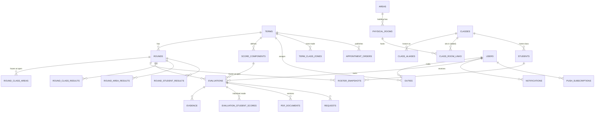

# 03 — Database

Source of truth: `db/schema.ts` (Drizzle). It has been generated into SQL with drizzle-kit and applied to
PostgreSQL 16 together with `RAW_SQL` (35 tables; exclusion constraints, the append-only trigger and the reference data are covered by `pnpm test:db`). Extend it; do not rewrite it.

## 1. Entity map

## 2. Table groups

| Group | Tables | Notes |
|---|---|---|
| Identity | `users`, `sessions`, `api_keys` | Session id = sha256(cookie token). API keys hashed. |
| Term rules | `terms`, `rounds`, `score_components` | Everything a school may change lives here. |
| Places | `areas`, `physical_rooms`, `classes`, `class_aliases`, `class_skip_rules`, `class_room_links`, `term_classes`, `term_class_zones` | `areas.type` is zone or building. |
| Round freeze | `round_class_areas`, `roster_snapshots` | Written when a round opens. |
| Work | `duties`, `evaluations`, `evaluation_student_scores`, `evidence`, `pdf_documents`, `requests` | |
| Results | `round_class_results`, `round_area_results`, `round_student_results` | Recomputed live; `frozen=true` after finalize. |
| Content | `appointment_orders`, `guide_pages` | |
| Ops | `notifications`, `push_subscriptions`, `sync_runs`, `audit_logs` | `audit_logs` append-only. |

Term score is **not stored**; it is computed from frozen round results (cheap: ≤ 100 classes × ≤ 10 rounds).

## 3. Invariants (enforced where noted)

| # | Invariant | Where |
|---|---|---|
| I1 | One live evaluation per (round, component, target) | partial unique indexes (RAW_SQL) |
| I2 | A class is in at most one physical room at a time; a room holds at most one class | exclusion constraints (RAW_SQL) |
| I3 | Evaluation/duty target has exactly one of class/area id matching `target_type` | CHECK constraints |
| I4 | Term config is immutable once `config_locked_at` is set | service (`term.service.updateConfig`) |
| I5 | `evaluations.score` is within [0, component.max] and on the term's step grid | service + Zod |
| I6 | Evidence count within photo min/max; exactly 1 signature | service at submit |
| I7 | Nothing in a `finalized` round changes except through an approved request that also unfreezes and refreezes results | service |
| I8 | `students.full_name` is never selected by any query that feeds a UI response | code review + lint rule `no-student-name` (see 13-testing) |
| I9 | Only one waiting request per (evaluation, type) | partial unique index |

## 4. Important queries (write them as repository functions)

1. **Targets for a committee member** — duties(term, user, committee) → classes/areas → left join the evaluation
   of the open round per component → status for the task list. Index: `duties_user_term_idx`, `evaluations_round_idx`.
2. **Coverage report** — every class selected for the term (`term_classes`) and every area of the term's area type, count of committee duties; rows
   with 0 or > 1 highlighted.
3. **Round board** — all targets × components with evaluation status; used by dashboard and finalize check.
4. **Public results** — `round_class_results` + `round_area_results` where the round has any approved data
   (live rows, not only frozen), filtered to approved evaluations only.

## 5. Migration rules

- Every schema change = new drizzle-kit migration, never edit an applied one.
- Seed script (`db/seed.ts`) creates: super admin, 2 admins, 3 executives, 1 term 2/2569 (building, group,
  decimal step 0.5, room 5 + building 10 = 15, 3 rounds), 8 buildings, the real class names from docs/10 §1.4,
  physical rooms `1xx`…`8xx`, and 200 **fake** students. Never seed real student data.
- `class_skip_rules` for มุตะวัซซิต (`มุตะวัซซิต`, `1M `, `2M `, `3M `) is reference data: insert it in a migration
  (not only in the dev seed) so production has it from day one (BR-Y step 4a).
